# gonzalo-munoz.com

An interactive Super Simple Super Mario-themed portfolio webpage that gamifies the presentation of professional information.

## About

This project is a creative and engaging way to showcase professional credentials through a retro-style browser game. Visitors control a Mario character to discover information by jumping and hitting question mark boxes, each revealing different aspects of the portfolio.

## Personal Information

**Name:** Gonzalo Munoz

**Professional Profile:**
- 11+ years of experience as Software Engineer / Cloud Engineer / AWS Expert
- Email: gonzaloan.munoz@gmail.com
- LinkedIn: [linkedin.com/in/mmgonzalo](https://www.linkedin.com/in/mmgonzalo)
- Notes/Blog: [guide.gonzalo-munoz.com](https://guide.gonzalo-munoz.com)

**Technical Skills:**
- Java
- Angular
- Golang
- AWS
- Python

**Certifications:**
- 10x AWS Certified
- GCP Cloud Engineer
- OCA 8 (Oracle Certified Associate)

## Features

- Interactive Super Mario-themed game interface
- Keyboard controls (Arrow keys, WASD, Space) and mobile touch controls
- 5 information boxes revealing different professional details:
  - About Me
  - Experience
  - Skills
  - Certifications
  - Contact
- Coin collection system tracking discovered information
- Responsive design with mobile-friendly controls
- Custom favicon and branding
- Animated clouds and retro aesthetics
- Completion modal with LinkedIn contact link

## How to Play

1. Use **Arrow Keys** (←/→) or **A/D** to move left and right
2. Use **Space** or **↑** to jump
3. On mobile: Use the on-screen arrow buttons to move
4. Jump and hit the **?** boxes to reveal information
5. Collect all 5 coins to complete the experience and unlock the LinkedIn contact link

## Technology Stack

- Pure HTML5, CSS3, and JavaScript (ES6+)
- No frameworks or dependencies
- Responsive design with mobile-first approach
- CSS animations and transitions
- Object-oriented JavaScript architecture

## Project Structure

```
.
├── index.html          # Main HTML structure
├── script.js           # Game logic and interactions
├── styles.css          # Visual styling and animations
├── favicon.ico         # Site favicon
└── img/               # Image assets
    ├── logo.png
    └── linkedin.png
```

## Deployment

This project uses a fully automated AWS CI/CD pipeline for deployment:

### Architecture

```mermaid
flowchart LR
    A[GitHub Repository] -->|Push to main| B[AWS CodePipeline]
    B -->|Triggers| C[AWS CodeDeploy]
    C -->|Deploys static files| D[AWS S3 Bucket]
    D -->|Static website hosting| E[Route 53]
    E -->|DNS: gonzalo-munoz.com| F[End Users]

    style A fill:#24292e,stroke:#ffffff,stroke-width:2px,color:#ffffff
    style B fill:#FF9900,stroke:#232F3E,stroke-width:2px,color:#232F3E
    style C fill:#FF9900,stroke:#232F3E,stroke-width:2px,color:#232F3E
    style D fill:#569A31,stroke:#232F3E,stroke-width:2px,color:#ffffff
    style E fill:#8C4FFF,stroke:#232F3E,stroke-width:2px,color:#ffffff
    style F fill:#0066cc,stroke:#232F3E,stroke-width:2px,color:#ffffff
```



### Deployment Pipeline

1. **Source Control**: Code is maintained in GitHub repository
2. **AWS CodePipeline**: Automatically triggered when changes are pushed to the `main` branch
3. **AWS CodeDeploy**: Handles the deployment process, moving all static files to S3
4. **AWS S3**: Configured as a static website hosting bucket
5. **Route 53**: Manages DNS for the custom domain `gonzalo-munoz.com`

### AWS Services Used

- **CodePipeline**: Orchestrates the CI/CD workflow
- **CodeDeploy**: Automates deployment of static assets
- **S3**: Hosts the static website files
- **Route 53**: DNS management and domain routing

This setup ensures that every commit to the main branch is automatically deployed to production, demonstrating modern DevOps practices and AWS expertise.

## License

Personal portfolio project - All rights reserved

---

Made with creativity and code by Gonzalo Munoz
